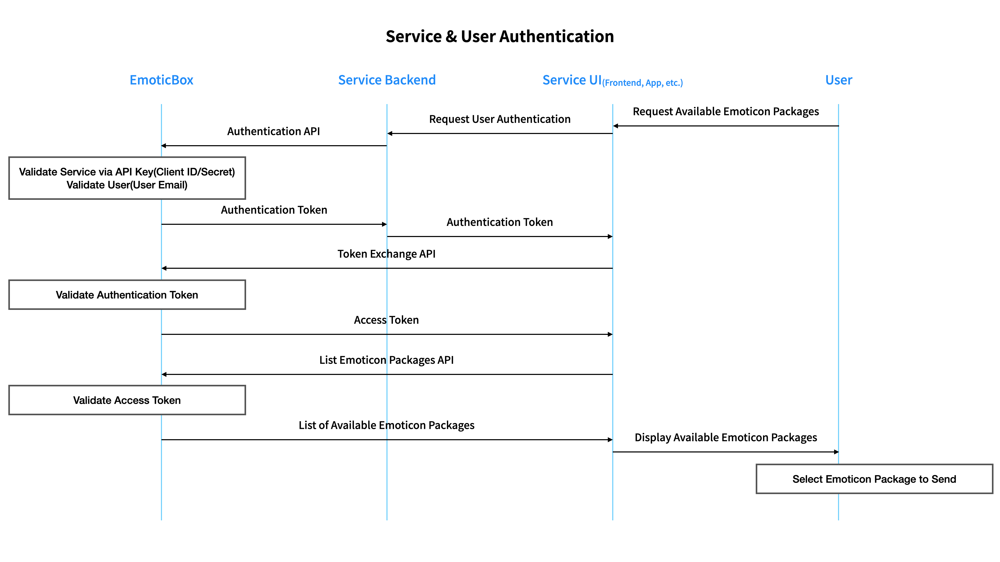
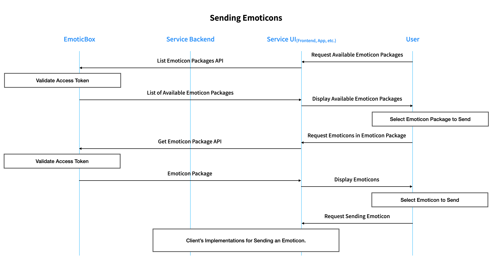

# 소개

EmoticBox API 문서입니다.

<aside class="notice">
API의 전반적인 흐름을 제외한 세부사항은 베타 버전 출시 전까지 수시로 변경될 수 있습니다.
</aside>

EmoticBox API에 대한 기술적 개선점 또는 EmoticBox API 문서에 대한 개선점은 <a href="mailto:tech@emoticbox.com">EmoticBox 기술지원(tech@emoticbox.com)</a>으로 보내주시면 면밀히 검토 후 회신드리겠습니다.

## 용어

### 고객(사)

Emoticon API를 사용하는 고객(사)를 의미합니다.

### 사용자

고객(사) 서비스를 사용하는 사용자를 의미합니다.

유의어: User

### 서비스

Emoticon API를 사용하는 고객(사)의 서비스를 의미합니다.
Emoticon API를 사용하기 위해서는 서비스를 등록하고 API 키를 발급받아야 합니다.

유의어: Service

### 서비스 ID

서비스를 구분하기 위한 UUID 형식의 고유값입니다.
서비스 ID는 서비스 등록시 자동으로 생성되며 변경할 수 없습니다.
서비스를 삭제하고 새로 등록하는 경우 새 서비스 ID가 생성되며 서로 다른 서비스로 간주됩니다.

유의어: Service ID

### API 키

고객사 서비스를 인증하기 위한 비밀키입니다.
한 서비스에 대해 여러 API 키를 발급받을 수 있습니다.

<aside class="warning">
API Key는 외부에 공개되지 않아야 합니다.
</aside>

<aside class="notice">
API Key가 외부에 유출되었거나 유출되었다고 판단되는 경우 즉시 <a href="mailto:tech@emoticbox.com">EmoticBox 기술지원(tech@emoticbox.com)</a>으로 문의해주시기 바랍니다.
</aside>

유의어: API Key

### 이모티콘

이모티콘 패키지에 포함되어 있는 각각의 이모티콘을 의미합니다.

### 이모티콘 패키지

여러 이모티콘의 묶음으로 이모티콘의 최소 판매 단위입니다.
한 이모티콘 패키지에는 16개, 24개, 32개 또는 40개의 이모티콘이 포함되어 있습니다.

### 브랜드 이모티콘 패키지

* 준비중입니다.

### 사용 가능한 이모티콘 패키지

사용자가 EmoticBox 회원인 경우 사용 가능한 이모티콘 패키지는 기본 제공 이모티콘 패키지는 사용자가 EmoticBox에서 구매한 이모티콘 패키지로 구성되며, 사용자가 EmoticBox 회원이 아닌 경우에는 기본 제공 이모티콘 패키지로만 구성됩니다.

### 탭 이미지

이모티콘 패키지의 대표 이미지로 사용자가 사용할 이모티콘 패키지를 선택할 때 표시됩니다.

# 인증

EmoticBox API를 사용하기 위해서는 서비스 ID와 API 키를 사용하여 엑세스 토큰을 발급받아야 합니다.
아래 시퀀스 다이어그램은 인증 및 엑세스 토큰 절차를 보여줍니다.


&#9651; 인증 및 엑세스 토큰 발급 절차(이미지를 새 탭에서 열면 크게 볼 수 있습니다)

## REST API

### Authorize User

```javascript
const fetch = require('node-fetch');

const endpoint = 'https://api.emoticbox.com/api-auth/v0';

fetch(`${endpoint}/auth`, {
  method: 'POST',
  body: {
    serviceId: 'your_service_id',
    apiKey: 'your_api_key',
    userEmail: 'user_email@your_domain.com',
  },
})
  .then((res) => {
    return res.json();
  })
  .then((json) => {
    console.log(json.authenticationToken);
  })
  .catch((err) => {
    console.log(err);
  });
```

<aside class="notice">
이 API는 고객사 서버에서 호출하여야 합니다.
</aside>

#### HTTP Request

```json
{
  "serviceId": "your_service_id",
  "apiKey": "your_secret_key",
  "userEmail": "user_email@your_domain.com"
}
```

`POST /auth`

##### Body Parameters

Parameter | Type | Required | Description
--------- | ---- | -------- | -----------
serviceId | string | true | 고객사 서비스 ID.
apiKey | string | true | 고객사 서비스 API 키.
userEmail | string | true | Access Token을 요청한 사용자의 이메일.

* `userEmail`은 사용자가 EmoticBox에서 고객사 서비스와 연동시 등록한 이메일과 일치해야 합니다.

#### HTTP Response

```json
{
  "authToken": "authentication-token"
}
```

Field | Type | Description
----- | ---- | -----------
authToken | string | 인증 토큰

### Token Exchange

```javascript
const endpoint = 'https://api.emoticbox.com/api-auth/v0';

fetch(`${endpoint}/token`, {
  method: 'POST',
  body: {
    authenticationToken: 'authentication-token',
  },
})
  .then((res) => {
    return res.json();
  })
  .then((json) => {
    console.log(json.accessToken);
  })
  .catch((err) => {
    console.log(err);
  });
```

<aside class="notice">
이 API는 클라이언트에서 호출하여야 합니다.
</aside>

#### HTTP Request

`POST /token`

```json
{
  "authToken": "authentication-token"
}
```

##### Body Parameters

Field | Type | Required | Description
------|------|----------|------------
authToken | string | true | Authorize User API를 통해 발급받은 인증 토큰

#### HTTP Response

```json
{
  "accessToken": "access-token"
}
```

Field | Type | Description
----- | ---- | -----------
accessToken | string | 엑세스 토큰

## API Rate Limit

TBD

# 이모티콘 API

아래 시퀀스 다이어그램은 이모티콘 패키지에 포함되어 있는 이모티콘을 불러와 전송하는 절차를 보여줍니다.


&#9651; 이모티콘 전송 절차(이미지를 새 탭에서 열면 크게 볼 수 있습니다)

## REST API

### List Available Emoticon Packages

인증된 사용자가 사용 가능한 이모티콘 패키지 목록을 불러옵니다.
사용 가능한 이모티콘 패키지에는 아래 이모티콘 패키지가 포함됩니다.

* 기본 제공되는 이모티콘 패키지
* 사용자가 EmoticBox에서 구매한 이모티콘 패키지(사용자가 EmoticBox 회원인 경우)

```javascript
const endpoint = 'https://api.emoticbox.com/emoticon-api/v0';
const accessToken = 'access-token';

fetch(`${endpoint}/emoticon`, {
  method: 'GET',
  headers: {
    Authorization: `Bearer ${accessToken}`,
  },
})
  .then((res) => {
    return res.json();
  })
  .then((json) => {
    for (const i; i < json.numEmoticonPacks; i += 1) {
      console.log(json.emoticonPacks[i]);
    }
  })
  .catch((err) => {
    console.log(err);
  });
```

#### HTTP Request

`GET /emoticon`

##### Header Parameters

Field | Required | Description
------|----------|------------
Authorization | true | Token Exchange API를 통해 발급받은 엑세스 토큰(`Bearer access-token`)

#### HTTP Response

```json
{
    "numEmoticonPacks": {Integer},
    "emoticonPacks": [{
      "id": {Integer},
      "name": {String},
      "isAnimated": {Boolean},
      "tabImage": {
        "color": {String},
        "grayscale": {String},
      }
    },
    {
      "id": {Integer},
      "name": {String},
      "isAnimated": {Boolean},
      "tabImage": {
        "color": {String},
        "grayscale": {String},
      }
    },
    ...
    ]
}
```

Field | Type | Description
----- | ---- | -----------
numEmoticonPacks | integer | 이모티콘 패키지의 개수
emoticonPacks | emoticonPack[] | 이모티콘 패키지 리스트
emoticonPack.id | string | 이모티콘 패키지의 ID
emoticonPack.name | string | 이모티콘 패키지의 이름
emoticonPack.isAnimated | boolean | 이모티콘 패키지의 애니메이션 여부
emoticonPack.tabImage | tabImage{} | 이모티콘 패키지 탭 이미지
tabImage.color | string | 이모티콘 패키지 컬러 탭 이미지 ID
tabImage.grayscale | string | 이모티콘 패키지 흑백 탭 이미지 ID


### Get Emoticon Package

```javascript
const endpoint = 'https://api.emoticbox.com/emoticon-api/v0';
const accessToken = 'access-token';
const emoticonId = 123;

fetch(`${endpoint}/emoticon/${emoticonId}`, {
  method: 'GET',
  headers: {
    Authorization: `Bearer ${accessToken}`,
  },
})
  .then((res) => {
    return res.json();
  })
  .then((json) => {
    for (const i; i < json.numEmoticons; i += 1) {
      console.log(json.emoticons[i]);
    }
  })
  .catch((err) => {
    console.log(err);
  });
```

#### HTTP Request

`GET /emoticon/:emoticonPackId`

##### Path Parameters

Field | Description
------|------------
emoticonPackId | 정보를 요청할 이모티콘 패키지의 ID(UUID 형식)

##### Header Parameters

Field | Required | Description
------|----------|------------
Authorization | true | Token Exchange API를 통해 발급받은 엑세스 토큰(`Bearer abcd...`)

#### HTTP Response

```json
{
  "id": {String},
  "name": {String},
  "numEmoticons": {Integer},
  "isAnimated": {Boolean},
  "tabImage": {
    "color": {String},
    "grayscale": {String},
  },
  "emoticons": [
    {
      "id": {String},
      "order": {Integer},
    },
    {
      "id": {String},
      "order": {Integer},
    },
    ...
  ]
}
```

Field | Type | Description
----- | ---- | -----------
id | string | 이모티콘 패키지의 ID
name | string | 이모티콘 패키지의 이름
numEmoticons | integer | 패키지에 포함된 이모티콘의 개수
tabImage | tabImage{} | 탭 이미지 정보
tabImage.color | string | 이모티콘 패키지 컬러 탭 이미지 ID
tabImage.grayscale | string | 이모티콘 패키지 흑백 탭 이미지 ID
emoticons | emoticon[] | 이모티콘 정보
emoticon.id | string | 이모티콘 ID
emoticon.order | integer | 이모티콘 번호(순서)

## 이모티콘 이미지 표시 방법

<a href="./#list-emoticon-packages-api">List Emoticon Packages API</a>를 통해 얻을 수 있는 이모티콘 패키지 목록 또는 <a href="./#get-emoticon-package-api">Get Emoticon Package API</a>를 통해 얻을 수 있는 이모티콘 패키지 정보에는 해당 패키지의 탭 이미지 ID(UUID 형식)가 포함되어 있습니다.

<a href="./#get-emoticon-package-api">Get Emoticon Package API</a>를 통해 얻을 수 있는 이모티콘 패키지 정보에는 해당 패키지에 포함된 모든 이모티콘의 ID(UUID 형식)가 포함되어 있습니다.
하나의 이모티콘 패키지에는 16개, 24개, 32개 또는 40개의 이모티콘이 포함되어 있을 수 있습니다.

이모티콘 패키지 파일에는 확장자가 없으며 각 파일 형식에 따라 적절한 `Content-Type` 헤더를 포함하여 응답합니다.

### 이모티콘 패키지 탭 이미지

이모티콘 패키지 탭 이미지는 아래와 같이 URL을 구성하여 불러올 수 있습니다.

`https://emoticon.emoticbox.com/dist/{format}/tab/{id}`

```html


```

* 포맷: `webp`, `png`
* 크기: 96px &times; 74px 단일 크기로만 제공

### 정지한 이모티콘 이미지

정지한 이모티콘 이미지는 아래와 같이 URL을 구성하여 불러올 수 있습니다.
애니메이션 여부와 관련없이 모든 이모티콘 패키지에는 정지한 이모티콘 이미지가 존재합니다.

`https://emoticon.emoticbox.com/dist/{format}/size/static/{id}`

```html


```

* 포맷: `webp`, `png`
* 크기: `320`(320px &times; 320px), `240`(240px &times; 240px), `160`(160px &times; 160px), `120`(120px &times; 120px), `80`(80px &times; 80px)

### 일정 횟수만 재생되는 움직이는 이모티콘 이미지

일정 횟수만 재생되는 움직이는 이모티콘 이미지는 아래와 같이 URL을 구성하여 불러올 수 있습니다.
재생 횟수는 크리에이터가 설정한 값을 따릅니다.
애니메이션이 없는 이모티콘 패키지(`isAnimated`가 `false`인 경우)는 움직이는 이모티콘 이미지가 존재하지 않습니다.

`https://emoticon.emoticbox.com/dist/{format}/size/animated/{id}`

```html


```

* 포맷: `webp`, `png`
* 크기: `320`(320px &times; 320px), `240`(240px &times; 240px), `160`(160px &times; 160px), `120`(120px &times; 120px), `80`(80px &times; 80px)

### 반복 재생되는 움직이는 이모티콘 이미지

반복 재생되는 이모티콘 이미지는 아래와 같이 URL을 구성하여 불러올 수 있습니다.
애니메이션이 없는 이모티콘 패키지(`isAnimated`가 `false`인 경우)는 움직이는 이모티콘 이미지가 존재하지 않습니다.

`https://emoticon.emoticbox.com/dist/{format}/size/loop/{id}`

```html


```

* 포맷: `webp`, `png`
* 크기: `320`(320px &times; 320px), `240`(240px &times; 240px), `160`(160px &times; 160px), `120`(120px &times; 120px), `80`(80px &times; 80px)

## API Rate Limit

TBD

# Errors

아래는 일반적인 오류 상황에서 돌려받는 [HTTP 상태 코드](https://developer.mozilla.org/en-US/docs/Web/HTTP/Status)입니다.

Error Code | Meaning
---------- | -------
400 Bad Request | 요청이 올바르지 않습니다(필요한 파라미터가 없는 경우, 파라미터가 올바르지 않은 경우 등).
401 Unauthorized | 엑세스 토큰이 존재하지 않거나 올바르지 않습니다.
403 Forbidden | 접근 권한이 없는 리소스입니다.
404 Not Found | 요청한 리소스가 존재하지 않습니다.
405 Method Not Allowed | 잘못된 HTTP Method로 요청하였습니다.
429 Too Many Request | API 요청이 너무 많습니다. <a href="./#api-rate-limit">API Rate Limit</a>을 참조하세요.
500 Internal Server Error | EmoticBox 서버 오류가 발생했습니다. 반복해서 발생하면 <a href="mailto:tech@emoticbox.com">EmoticBox 기술지원(tech@emoticbox.com)</a>으로 문의해주세요.
